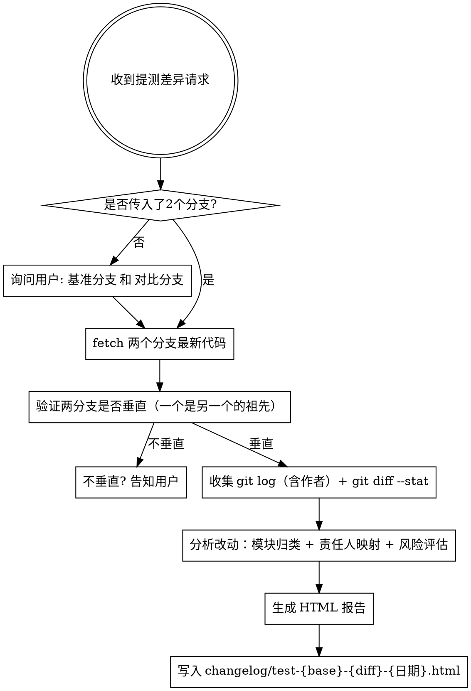

# generate-test-diff

## Overview

在提测阶段，基于两个 Git 分支的 commit 历史和 diff 差异，自动生成结构化的 **HTML 提测报告**，帮助测试同学快速了解改动范围、责任人和测试重点。

## When to Use

- 用户说"提测"、"生成差异"、"生成 changelog"、"分支差异"、"提测差异"
- 用户运行 `/changelog` 命令
- 用户需要将改动范围同步给测试同学时

## Decision Flow



## Steps

### 1. 获取分支和版本号

若用户未传入分支，询问：
> 请告诉我要对比的两个分支：
> 1. **基准分支**（通常是 release/master，作为对比基线）
> 2. **对比分支**（通常是 dev/feature 分支，包含本次改动）

无论用户是否传入了分支，都必须询问版本号：
> 本次提测的版本号是多少？（例如 v0.1.11）

版本号用于文件命名，若用户未提供则默认使用 `v0.0.0`。

### 2. Fetch 并验证垂直关系

```bash
# 先拉取最新代码，避免本地缓存导致遗漏 commit
git fetch origin <BASE_BRANCH> <DIFF_BRANCH>

# 检查 BASE_BRANCH 是否是 DIFF_BRANCH 的祖先
git merge-base --is-ancestor origin/<BASE_BRANCH> origin/<DIFF_BRANCH>
# 返回 0 = 垂直关系（正确）
# 返回 1 = 非垂直关系（拒绝，告知用户）
```

若非垂直关系，停止并提示：
> ⚠️ 这两个分支不是垂直关系，无法生成有意义的差异报告。请确认基准分支是对比分支的祖先（例如 release → dev）。

### 3. 收集数据（并行执行）

```bash
# ① commit 列表（含作者姓名、邮箱、消息）—— 必须用 --no-merges 排除合并提交
git log origin/<BASE_BRANCH>..origin/<DIFF_BRANCH> --no-merges \
  --format="%h|%an|%ae|%s"

# ② 文件级改动统计
git diff origin/<BASE_BRANCH>...origin/<DIFF_BRANCH> --stat

# ③ 新增/修改/删除文件分类（用于统计卡片）
git diff origin/<BASE_BRANCH>...origin/<DIFF_BRANCH> --name-status \
  | awk '{print $1}' | sort | uniq -c
```

> **注意**：`git log A..B` 用两个点；`git diff A...B` 用三个点（从分叉点起的差异）。两者语义不同，不要混用。

### 4. 分析数据

#### 4.1 统计开发者贡献

从 commit 列表中按作者分组，统计每人的 commit 数量，用于"开发者贡献"卡片。

#### 4.2 模块归类与责任人映射

根据 diff --stat 的文件路径，将改动归类到业务模块，并从 commit 作者中推断每个模块的主要负责人：

| 路径特征 | 归属模块 |
|---------|---------|
| `app/api/auth/` | 认证 API |
| `app/api/employeeList/` | 员工列表 API |
| `app/login/` | 登录页面 |
| `app/formPage/` | 表单页面 |
| `app/apitest/` | API 调试页面 |
| `lib/` | 数据库、认证和客户端基础设施 |
| `types/` | TypeScript 类型 |
| `sql/` | 数据库脚本 |

模块负责人 = 该模块相关 commit 中出现最多的作者。

#### 4.3 风险评估

按以下规则为每个模块评定风险等级：

- 🔴 **高风险**：核心流程（创建/提交任务）、共用组件（packages/ui）、大量重构（单文件改动 > 300 行）
- 🟡 **中风险**：列表页新增筛选条件、弹窗新增、API 字段变更
- 🟢 **低风险**：样式调整、文档更新、纯新增功能（不影响已有流程）

### 5. 生成 HTML 报告

报告包含以下章节，参考下方 HTML 模板：

1. **变更概览**：统计卡片（文件数、新增行、删除行、提交数、开发者数）
2. **开发者贡献**：每位开发者的 commit 数量和负责模块
3. **涉及的页面 / 模块**：表格，含路径、改动类型、风险等级、负责人
4. **改动详情**：按模块分组，每个模块列出具体改动点
5. **影响范围**：直接影响 + 间接影响（重点标注共用组件的影响）
6. **重点测试范围**：带复选框的测试清单，按优先级排序
7. **Commit 列表**：完整列表，含 hash、作者、描述

### 6. 写入文件

```bash
mkdir -p <项目根目录>/changelog
```

文件命名：`{版本号}-{base分支名}-{diff分支名}-{YYYY-MM-DD}.html`

示例：`v0.1.11-release-dev-2026-05-14.html`

存放路径：项目根目录下的 `changelog/` 目录

## HTML 模板

生成的 HTML 文件使用以下结构和样式（完整复现，不要简化）：

```html
<!DOCTYPE html>
<html lang="zh-CN">
<head>
    <meta charset="UTF-8">
    <meta name="viewport" content="width=device-width, initial-scale=1.0">
    <title>提测差异报告 - {DIFF_BRANCH}</title>
    <style>
        * { margin: 0; padding: 0; box-sizing: border-box; }
        body {
            font-family: -apple-system, BlinkMacSystemFont, "Segoe UI", Roboto, "Helvetica Neue", Arial, sans-serif;
            line-height: 1.6; color: #333; background: #f5f7fa; padding: 20px;
        }
        .container { max-width: 1200px; margin: 0 auto; background: white; box-shadow: 0 2px 8px rgba(0,0,0,0.1); border-radius: 8px; overflow: hidden; }
        .header { background: linear-gradient(135deg, #667eea 0%, #764ba2 100%); color: white; padding: 40px; text-align: center; }
        .header h1 { font-size: 32px; margin-bottom: 10px; }
        .header .meta { font-size: 14px; opacity: 0.9; }
        .content { padding: 40px; }
        h2 { color: #2c3e50; font-size: 22px; margin: 30px 0 20px; padding-bottom: 10px; border-bottom: 2px solid #667eea; }
        h3 { color: #34495e; font-size: 18px; margin: 25px 0 15px; }
        h4 { color: #555; font-size: 15px; margin: 15px 0 8px; }
        /* 统计卡片 */
        .summary-grid { display: grid; grid-template-columns: repeat(auto-fit, minmax(160px, 1fr)); gap: 16px; margin: 20px 0; }
        .summary-card { background: #f8f9fa; padding: 20px; border-radius: 8px; border-left: 4px solid #667eea; }
        .summary-card .label { font-size: 12px; color: #666; text-transform: uppercase; margin-bottom: 5px; }
        .summary-card .value { font-size: 24px; font-weight: bold; color: #2c3e50; }
        /* 开发者卡片 */
        .dev-grid { display: grid; grid-template-columns: repeat(auto-fit, minmax(220px, 1fr)); gap: 16px; margin: 20px 0; }
        .dev-card { background: #f8f9fa; padding: 16px 20px; border-radius: 8px; border-left: 4px solid #764ba2; }
        .dev-card .dev-name { font-size: 16px; font-weight: bold; color: #2c3e50; margin-bottom: 6px; }
        .dev-card .dev-commits { font-size: 13px; color: #666; margin-bottom: 8px; }
        .dev-card .dev-modules { font-size: 12px; color: #888; }
        /* 表格 */
        table { width: 100%; border-collapse: collapse; margin: 16px 0; }
        th { background: #667eea; color: white; padding: 12px; text-align: left; font-weight: 600; font-size: 13px; }
        td { padding: 11px 12px; border-bottom: 1px solid #e8e8e8; font-size: 13px; }
        tr:hover { background: #f8f9fa; }
        /* 风险标签 */
        .risk-high { color: #e74c3c; font-weight: bold; }
        .risk-medium { color: #f39c12; font-weight: bold; }
        .risk-low { color: #27ae60; font-weight: bold; }
        /* 改动类型徽章 */
        .badge { display: inline-block; padding: 3px 8px; border-radius: 4px; font-size: 11px; font-weight: 600; margin-right: 4px; }
        .badge-new { background: #27ae60; color: white; }
        .badge-modified { background: #3498db; color: white; }
        .badge-deleted { background: #e74c3c; color: white; }
        /* 模块区块 */
        .module-section { background: #f8f9fa; padding: 20px; border-radius: 8px; margin: 16px 0; border-left: 3px solid #667eea; }
        .module-section h3 { margin-top: 0; }
        .module-meta { font-size: 12px; color: #888; margin-bottom: 12px; }
        /* 提示框 */
        .alert { padding: 14px 18px; margin: 16px 0; border-radius: 6px; border-left: 4px solid; font-size: 13px; }
        .alert-danger { background: #fef0f0; border-color: #e74c3c; color: #c0392b; }
        .alert-warning { background: #fff8e6; border-color: #f39c12; color: #856404; }
        .alert-info { background: #e8f4fd; border-color: #3498db; color: #2980b9; }
        .alert-success { background: #eafaf1; border-color: #27ae60; color: #155724; }
        /* 测试清单 */
        .checklist { list-style: none; margin: 12px 0; padding: 0; }
        .checklist li { padding: 8px 0; border-bottom: 1px solid #eee; font-size: 13px; display: flex; align-items: flex-start; gap: 10px; }
        .checklist li:last-child { border-bottom: none; }
        .checklist li::before { content: "☐"; font-size: 16px; color: #667eea; flex-shrink: 0; margin-top: 1px; }
        .checklist li strong { color: #2c3e50; }
        /* Commit 列表 */
        .commit-list { background: #f8f9fa; border-radius: 6px; overflow: hidden; }
        .commit-item { display: grid; grid-template-columns: 90px 1fr 100px; gap: 12px; padding: 10px 16px; border-bottom: 1px solid #e8e8e8; font-size: 13px; align-items: center; }
        .commit-item:last-child { border-bottom: none; }
        .commit-item:hover { background: #f0f0f0; }
        .commit-hash { font-family: 'Courier New', monospace; color: #667eea; font-size: 12px; }
        .commit-msg { color: #333; }
        .commit-author { color: #888; font-size: 12px; text-align: right; }
        code { background: #f0f0f0; padding: 2px 6px; border-radius: 3px; font-family: 'Courier New', monospace; font-size: 13px; }
        ul, ol { margin: 10px 0 10px 24px; }
        li { margin: 6px 0; font-size: 13px; }
        .footer { background: #2c3e50; color: #aaa; padding: 20px 40px; text-align: center; font-size: 13px; }
        @media print { body { background: white; padding: 0; } .container { box-shadow: none; } }
    </style>
</head>
<body>
<div class="container">
    <div class="header">
        <h1>提测差异报告</h1>
        <div class="meta">
            基准分支: <strong>{BASE_BRANCH}</strong> → 对比分支: <strong>{DIFF_BRANCH}</strong>
            &nbsp;|&nbsp; 生成时间: {YYYY-MM-DD HH:mm}
            &nbsp;|&nbsp; 共 {N} 个提交
        </div>
    </div>

    <div class="content">

        <!-- 一、变更概览 -->
        <h2>一、变更概览</h2>
        <div class="summary-grid">
            <div class="summary-card">
                <div class="label">变更文件数</div>
                <div class="value">{FILES}</div>
            </div>
            <div class="summary-card">
                <div class="label">新增代码行</div>
                <div class="value" style="color:#27ae60">+{INSERTIONS}</div>
            </div>
            <div class="summary-card">
                <div class="label">删除代码行</div>
                <div class="value" style="color:#e74c3c">-{DELETIONS}</div>
            </div>
            <div class="summary-card">
                <div class="label">提交次数</div>
                <div class="value">{COMMITS}</div>
            </div>
            <div class="summary-card">
                <div class="label">参与开发者</div>
                <div class="value">{DEVS}</div>
            </div>
        </div>

        <h3>主要功能点</h3>
        <ul>
            <!-- 列出 3-6 个核心功能点 -->
        </ul>

        <!-- 二、开发者贡献 -->
        <h2>二、开发者贡献</h2>
        <div class="dev-grid">
            <!-- 每位开发者一张卡片 -->
            <div class="dev-card">
                <div class="dev-name">{开发者姓名}</div>
                <div class="dev-commits">{N} 个提交</div>
                <div class="dev-modules">负责模块：{模块1}、{模块2}</div>
            </div>
        </div>

        <!-- 三、涉及的页面 / 模块 -->
        <h2>三、涉及的页面 / 模块</h2>
        <table>
            <thead>
                <tr>
                    <th>页面 / 模块</th>
                    <th>路径</th>
                    <th>改动类型</th>
                    <th>风险等级</th>
                    <th>负责人</th>
                </tr>
            </thead>
            <tbody>
                <!-- 每个模块一行 -->
                <tr>
                    <td>{模块名}</td>
                    <td><code>{路径}</code></td>
                    <td><span class="badge badge-modified">修改</span></td>
                    <td><span class="risk-high">🔴 高</span></td>
                    <td>{负责人}</td>
                </tr>
            </tbody>
        </table>

        <!-- 四、改动详情 -->
        <h2>四、改动详情</h2>
        <!-- 每个模块一个 module-section -->
        <div class="module-section">
            <h3>{模块名}</h3>
            <div class="module-meta">负责人：{负责人} &nbsp;|&nbsp; 风险：<span class="risk-high">🔴 高</span></div>
            <ul>
                <li><strong>{改动点}</strong>：{描述}</li>
            </ul>
        </div>

        <!-- 五、影响范围 -->
        <h2>五、影响范围</h2>
        <div class="alert alert-danger">
            <strong>直接影响</strong>
            <ul>
                <li>{直接影响的功能}</li>
            </ul>
        </div>
        <div class="alert alert-warning">
            <strong>间接影响</strong>
            <ul>
                <li>{间接影响，如共用组件变更影响多处}</li>
            </ul>
        </div>

        <!-- 六、重点测试范围 -->
        <h2>六、重点测试范围</h2>
        <div class="alert alert-info">以下清单按优先级排序，请优先覆盖高风险项。</div>
        <ul class="checklist">
            <li><strong>{测试项}</strong>：{测试描述和预期行为}</li>
        </ul>

        <!-- 七、Commit 列表 -->
        <h2>七、Commit 列表</h2>
        <div class="commit-list">
            <!-- 每个 commit 一行 -->
            <div class="commit-item">
                <span class="commit-hash">{hash}</span>
                <span class="commit-msg">{message}</span>
                <span class="commit-author">{author}</span>
            </div>
        </div>

    </div>

    <div class="footer">
        报告生成时间: {YYYY-MM-DD HH:mm}
    </div>
</div>
</body>
</html>
```

## Common Mistakes

| 错误 | 正确做法 |
|------|---------|
| 直接对比两个平行 feature 分支 | 必须是垂直分支，基准是 release/master |
| 忘记 fetch 导致遗漏最新 commit | 每次生成前先 `git fetch origin` |
| git log 未加 `--no-merges` 导致 commit 数虚高 | 始终加 `--no-merges` 排除合并提交 |
| commit 数量统计错误 | 用 `git log A..B --no-merges` 的实际输出行数，不要估算 |
| 遗漏部分模块（如 WorkflowList、SmartEdit） | 从 `git diff --stat` 的完整文件列表归类，不要只看 commit message |
| 报告过于笼统，只写"修改了代码" | 具体到页面路径和功能改动点 |
| 遗漏间接影响（如修改了共用组件） | 检查 diff 中涉及 `packages/`、`components/` 的改动 |
| 生成 markdown 而非 HTML | 输出格式必须是 HTML，存为 `.html` 文件 |
| 使用 git diff 但不加三点语法 | 用 `BASE...DIFF`（三个点）获取从分叉点以来的差异 |
